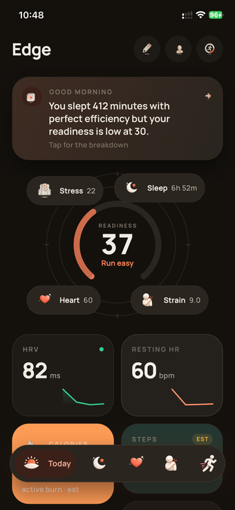
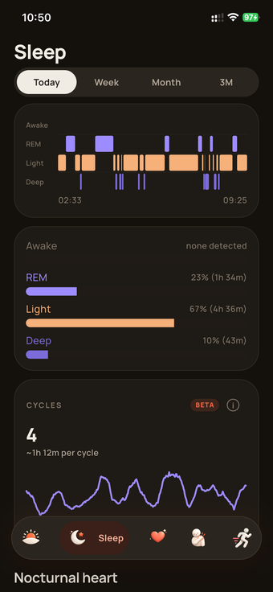
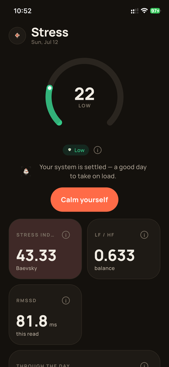
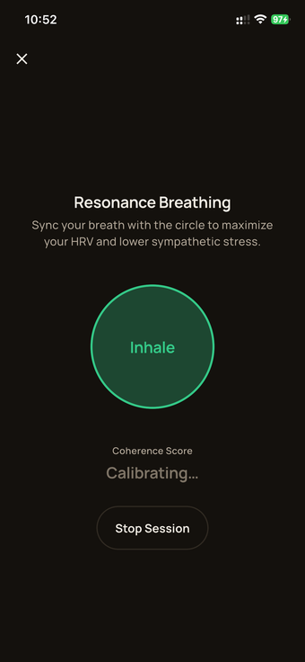
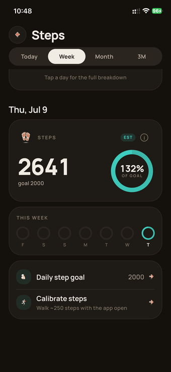
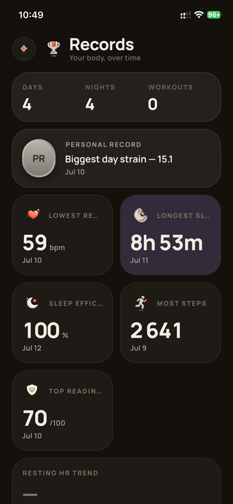
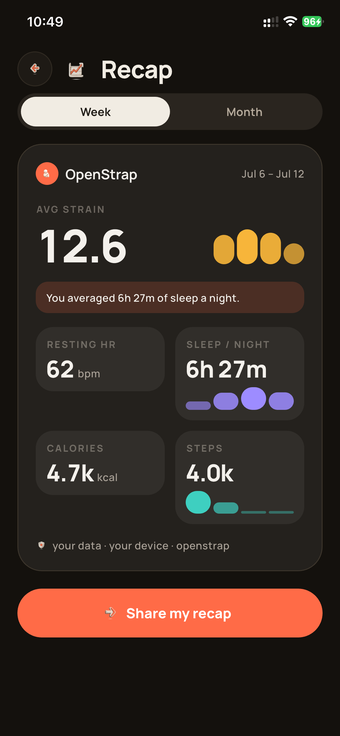
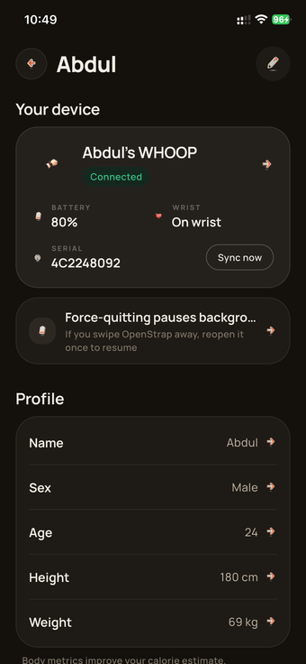
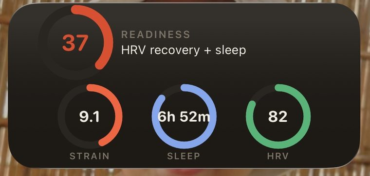
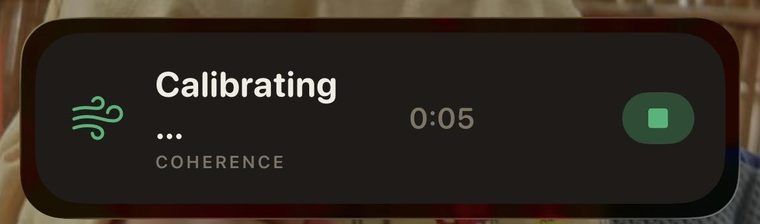

# Edge

This is the app. It connects to a WHOOP 4.0 over Bluetooth, pulls the data off it, and
does all the number-crunching right there on your phone. Flutter, runs on iOS and
Android. No cloud, no backend watching your health data, no server this needs to talk
to just to work day to day.

> Not affiliated with WHOOP. This is for a band you already own.

If your subscription lapsed and the band's been sitting in a drawer, this gives it
something to do again — heart rate, sleep, a strain number, a recovery number, trends
over time, and it's real output off real hardware, not a mockup.

Is it the same as WHOOP's own app? No, and it's not trying to be. They've got a research
team and years of data behind their scores; I've got a protocol I worked out myself and a
stack of published equations. So the numbers here are an honest read of what a wrist can
actually tell you, not a clone of their secret sauce. If you're happily paying WHOOP,
keep paying WHOOP. If the alternative is the band sitting in a drawer forever, this is
better than a drawer.

There are bugs. I've found some, definitely missed others. If a number looks wrong, open
an issue and I'll go dig into it — this gets better the more people actually poke at it.

One thing that actually matters: once you're using this, don't reconnect the band to
WHOOP's own app. A firmware push could quietly change the records this depends on and
there's no un-breaking that from here. Pick one app and stay on it.

## Screens

Today (readiness + the day's plan), Sleep, Heart, Stress, an HRV spot-check, Activity
(strain, auto-detected workouts, live workout with GPS routes), Cycle tracking, a Journal
with on-device personal-correlation insights — what actually moves your numbers, never a
cloud model guessing — Journey/Timeline/Records for the long view, a deterministic Coach,
a BYOK text AI assistant, a shareable weekly Recap, onboarding, pairing, profile. Every
metric drills into the same shared trend screen (today/week/month/3-month, inline
drill-down) so it behaves the same no matter where you tapped in from.

| | | |
|:--:|:--:|:--:|
| <br>**Today** | <br>**Sleep** | <br>**Heart** |
| <br>**Stress** | <br>**Breathing** | <br>**Body** |
| <br>**Steps** | <br>**Workouts** | <br>**Records** |
| <br>**Recap** | <br>**Profile** | |

iOS also gets a home-screen widget, a lock-screen/Dynamic Island Live Activity (workouts,
and now live coherence during a guided breathing session), and a couple of Siri intents —
check your recovery, check your strain, start a breathing session — through App Intents.

| | | |
|:--:|:--:|:--:|
| <br>**Widget** | <br>**Battery widget** | <br>**Live Activity** |

> Every screenshot above is real output from a WHOOP 4.0. Every figure carries a
> confidence, and estimates are labelled as such — the two analytics repos this depends
> on spell out the actual contract.

## How it's put together

```
   the screens (lib/ui)  ──read──►  AppState (lib/state)
                                        the one source of truth
        │                                    │
        ▼                                    ▼
   BleEngine (lib/ble)             LocalRepository (lib/data)
   talks to the band                reads/writes LocalDb (sqflite)
        │                                    │
        └─ frames ─► openstrap_protocol ─► decoded_onehz / decoded_rr
             (separate package: framing,        (the durable ledger)
              CRC, record/command decode)             │
                                                        ▼
                                          DerivationEngine (lib/compute)
                                          runs openstrap_analytics over the
                                          substrate, writes versioned
                                          day_result rows (kAlgoVersion)
```

`AppState` is a `ChangeNotifier`, and it's the only thing the UI ever reads. It owns the
BLE engine and the local-repository seam, so screens never touch Bluetooth or SQL
directly. The actual byte decoding and the actual analytics live in two separate packages
pulled in as git deps — [openstrap-protocol-dart](https://github.com/OpenStrap/protocol)
and [openstrap-analytics-onehz](https://github.com/OpenStrap/analytics). This repo is
the glue holding them to a phone: BLE reliability, local storage, the UI.

## The Bluetooth part, which is the hard part

`BleEngine` in `lib/ble/ble_engine.dart` (~3k lines, sorry) is where the real work
happens. The band speaks a custom GATT service (`61080001-...`) — one characteristic you
write commands to, a few you subscribe to for responses, events, and data.

A sync goes like this. Connect, bond (Android needs an explicit bond step), bump the MTU
to 247, subscribe to the notify characteristics. Then set the clock — the band ships with
its real-time clock unset, and if you skip this step every single record you pull off it
gets a garbage timestamp. Nothing about this is documented anywhere, you just find out the
hard way the first time your sleep data says you went to bed in 1970. Then fire the
five-packet intro that ends in "send me your history," and the band starts draining
records out of flash.

Here's the part that trips everyone up. The band sends records in batches, and after
each batch it sends a marker carrying an 8-byte token. You read that token and send it
straight back — with a write that waits for acknowledgement, not fire-and-forget. Echo it
exactly and the read cursor moves forward. Get the bytes wrong, or use the wrong write
type, and the band just re-sends the same batch forever, since as far as it's concerned
you never confirmed you got it. The commit to local storage happens **before** that
acknowledgement goes out, in the same transaction, never after — so a crash mid-sync
can't lose data or double-trim the band's flash.

This app runs one continuous listening mode, on purpose — no separate "sync" state vs.
"live" state to flip between. There used to be, and the flip itself caused a re-flood bug
that took a while to track down. Live high-rate streams (0x2B/0x33) never touch disk;
only the decoded 1 Hz substrate and RR beats are durable.

Two more things worth knowing. Live commands and sync acknowledgements use separate
sequence-number ranges so they never step on each other. And the genuinely dangerous
commands — the ones that wipe flash, reboot the strap, or push firmware — sit behind an
explicit guard and never get sent automatically; optical/PPG only turns on when the band's
actually on a wrist. You really don't want to brick one of these.

## DB schema, and why it looks this way

`lib/data/db.dart` (sqflite, WAL). There used to be a `raw_records` table holding
everything the band ever sent — that's gone, replaced by a decoded-first ledger:

- **`decoded_onehz`** + **`decoded_rr`** — the durable 1 Hz stuff (HR, accel, RR beats),
  keyed so a band counter reset recovers cleanly instead of corrupting history
  (newest-wins by timestamp, not a naive insert-and-ignore).
- **`raw_archive`** — anything the decoder couldn't parse (unknown firmware version)
  lands here and never gets pruned, so a future decoder update can go back and actually
  read it instead of it being gone for good.
- **`day_result`** — versioned by `(day_id, kAlgoVersion)`. An algorithm change writes a
  new row instead of overwriting history, and a day only gets pruned from the raw ledger
  once it's actually been derived — not just attempted, so a failed derivation still has
  its raw material around for a real retry.

Decoded rows get pruned once the day they belong to is safely derived. The archive and
the finalized results stick around.

## Background sync

You shouldn't have to open the app for this to work, and on Android you mostly don't
have to. iOS is a different story — Apple doesn't hand third-party apps a real
background-service option, so this leans on a pile of overlapping half-measures instead.

**Android**: a foreground service (`EdgeTrackingService`) keeps the process and the BLE
connection alive, backed by `CompanionDeviceManager` presence-watching and a periodic
watchdog worker. This one just works.

**iOS**: no foreground-service equivalent exists, so it's a live BLE connection held open
via `UIBackgroundModes: bluetooth-central` while backgrounded, plus a separate
CoreBluetooth restoration central that relaunches the app if that connection ever drops,
plus a `BGProcessingTask` and a lighter `BGAppRefreshTask` for opportunistic catch-up
sync. iOS decides if and when those actually run — force-quit the app and you get none of
them. That's the ceiling here without a real background-service option: covered, not
guaranteed. Every wake is skip-don't-queue, so a missed one just gets caught by the next
one instead of piling up and thrashing.

## Getting around the code

| Where | What's there |
|-------|--------------|
| `lib/ble/` | the BLE engine: connect, sync/drain, live streams, reconnect policy |
| `lib/data/` | the local SQLite store (`db.dart`) and the repository seam (`local_repository_impl.dart`) the UI actually reads |
| `lib/compute/` | `DerivationEngine` — runs `openstrap_analytics` over the substrate, writes `day_result` |
| `lib/sync/` | background-sync policy classes, the headless-entry gate, iOS BGTask wiring |
| `lib/cloud/` | the narrow, non-primary network surface: a one-time legacy-account import, OTA/announcement pointer, and the BYOK LLM proxy — **not an ongoing backend for your health data** |
| `lib/state/` | `AppState`, the one source of truth |
| `lib/ui/` | every screen — today, sleep, heart, stress, spotcheck, activity, workouts, cycle, journal, journey, recap, insights, timeline, records, coach, import, pairing, onboarding, profile |
| `lib/gps/` | GPS workout-route tracking (on-device only) |
| `lib/ai/`, `lib/coach/` | the BYOK AI briefings/journal assistant and the deterministic coaching engine |
| `lib/widget/`, `lib/live/` | the home-screen widget and the iOS Live Activity bridges |
| `ios/OpenStrapWidget/` | the actual widget and Dynamic Island Live Activity (needs an App Group you configure for your own Apple team) |

The actual protocol decode (`openstrap_protocol`) and the actual analytics
(`openstrap_analytics`) don't live in this repo at all — separate git deps. If you're
after record byte layouts or metric formulas, they're over there, not here.

## Running it

```bash
cp .env.example .env
flutter pub get
flutter run --dart-define-from-file=.env
```

`.env.example` documents two optional build-time defines: `BACKEND_URL` (only used for
the one-time legacy-account import at onboarding — leave it blank if you've got nothing
to import) and `COMPANION_URL` (only used for the OTA/announcement pointer and the BYOK
LLM proxy — also optional). The app works fine without either.

Quit the official WHOOP app before you connect — Bluetooth only lets one app own the band
at a time, no way around that.

On iOS, the widget and Live Activity need signing configured for your own Apple team and
a matching App Group. See `guides/IOS_INSTALLATION.md` — the repo ships with placeholder
bundle IDs and App Group values plus a gitignored local signing override, so none of it's
tied to my developer account specifically. Use Profile or Release builds for normal
iPhone home-screen relaunch testing; Flutter Debug builds need to go through Flutter
tooling or Xcode directly.

## Your data

Everything's computed and stored on your phone. There's no cloud sync for the running
app — the only network calls it ever makes are the three narrow, opt-in things listed
under `lib/cloud/` above, and none of them are required for the app to work. If you're a
returning user with an old cloud account, `BACKEND_URL` lets you pull that history down
once at onboarding. It's not an ongoing dependency after that.

## The stack, briefly

`openstrap_protocol` and `openstrap_analytics` (the two sibling packages this app is glue
around) plus `openstrap_icons`, `flutter_blue_plus` for Bluetooth, `sqflite` for the
local store, `provider` and `shared_preferences` for the plumbing, `http` for the narrow
network surface above, `fl_chart` / `google_fonts` / `hugeicons` / `share_plus` for the
look of it.

---

Found something broken? Open an issue. Found something broken and fixed it? Even better,
send the PR.
